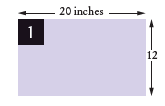
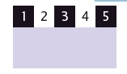

> Nama : Julia Hasanah  
> Nim : 2110131120005

  

7/e

 <b>cay Horstmann</b> 

<b>Big Java</b>

 <b>Early Objects</b> 

   

  

<b>BAB 1</b>

<b>Pengantar</b>

   

## **1.1 Program Komputer**

Anda mungkin pernah menggunakan komputer untuk bekerja atau bersenang-senang. Banyak orang menggunakan komputer untuk tugas sehari-hari seperti perbankan elektronik atau menulis makalah. Komputer adalah baik untuk tugas-tugas seperti itu. Mereka dapat menangani tugas berulang, seperti menjumlahkan angka atau menempatkan kata-kata di halaman, tanpa merasa bosan atau lelah.  
Fleksibilitas komputer adalah fenomena yang cukup menakjubkan. Mesin yang sama dapat menyeimbangkan buku cek Anda, meletakkan kertas istilah Anda, dan bermain game. Sebaliknya, mesin lain melakukan berbagai tugas yang jauh lebih sempit; mobil yang dikendarai dan pemanggang roti bersulang. Komputer dapat melakukan berbagai tugas karena mereka menjalankan tugas yang berbeda program, yang masing-masing mengarahkan komputer untuk bekerja pada tugas tertentu.  
Komputer itu sendiri adalah mesin yang menyimpan data (angka, kata-kata, gambar), berinteraksi dengan perangkat (monitor, sistem suara, printer), dan menjalankan program. Sebuah program komputer memberi tahu komputer, secara rinci, urutan langkah-langkah yang diperlukan untuk memenuhi tugas. Komputer fisik dan perangkat periferal secara kolektif disebut perangkat keras. Program yang dijalankan komputer disebut barang lunak.  
Program komputer saat ini sangat canggih sehingga sulit dipercaya bahwa mereka terdiri dari instruksi yang sangat primitif. Instruksi tipikal mungkin satu dari berikut ini:  

- Letakkan titik merah pada posisi layar tertentu.
- Tambahkan dua angka.
- Jika nilai ini negatif, lanjutkan program pada instruksi tertentu.  

Pengguna komputer memiliki ilusi interaksi yang lancar karena sebuah program berisi sejumlah besar instruksi semacam itu, dan karena komputer dapat mengeksekusinya di kecepatan luar biasa.  
Tindakan merancang dan mengimplementasikan program komputer disebut pemrograman. Dalam buku ini, Anda akan belajar cara memprogram komputer yaitu cara mengarahkan komputer untuk menjalankan tugas.  
Untuk menulis game komputer dengan efek gerakan dan suara atau pengolah kata yang mendukung font dan gambar mewah adalah tugas kompleks yang membutuhkan tim yang terdiri dari banyak orang programmer yang sangat terampil. Upaya pemrograman pertama Anda akan lebih biasa.Konsep dan keterampilan yang Anda pelajari dalam buku ini membentuk fondasi penting, dan Anda tidak boleh kecewa jika program pertama Anda tidak menyaingi sophis ticated perangkat lunak yang akrab bagi Anda. Sebenarnya, Anda akan menemukan bahwa ada sensasi yang luar biasa bahkan dalam tugas pemrograman sederhana. Ini adalah pengalaman yang luar biasa untuk melihat komputerdengan tepat dan cepat melaksanakan tugas yang akan memakan waktu berjam-jam kerja keras, untuk membuat perubahan kecil dalam program yang mengarah pada perbaikan segera, dan untuk melihat komputer menjadi perpanjangan dari kekuatan mental Anda.
  

## **1.2 Anatomi Komputer**

Untuk memahami proses pemrograman, Anda harus memiliki pemahaman dasar dari blok bangunan yang membentuk komputer. Kami akan melihat secara pribadi komputer. Komputer yang lebih besar memiliki komponen yang lebih cepat, lebih besar, atau lebih kuat, tetapimereka pada dasarnya memiliki desain yang sama.  
Di jantung komputer terletak pusatnyaunit pemrosesan (CPU) (lihat Gambar 1). Bagian dalam pengkabelan CPU sangat rumit.Misalnya, prosesor Intel Core (yang populerCPU untuk per komputer pribadi pada saat initulisan) terdiri dari beberapa ratus juta elemen struktural, yang disebut transistor.CPU melakukan kontrol program dan data pengolahan. Artinya, CPU menempatkan dan mengeksekusi.  
instruksi program; itu melaksanakan operasi aritmatika seperti penjumlahan, pengurangan,perkalian, dan pembagian; itu mengambil datadari memori eksternal atau perangkat dan tempatdata yang diproses ke dalam penyimpanan.  
Ada dua macam penyimpanan. Penyimpanan primer, atau memori, dibuat dari sirkuit elektronik yang dapat menyimpan data, asalkan disuplai dengan daya listrik. Penyimpanan sekunder, biasanya hard disk (lihat Gambar 2) atau solid-state drive, menyediakan penyimpanan yang lebih lambat dan lebih murah yang bertahan tanpa listrik. Sebuah hard disk terdiri dari piringan berputar, yang dilapisi dengan magnet  

  

material. A solid-state drive uses electronic components that can retain information
without power, and without moving parts.  

Untuk berinteraksi dengan pengguna manusia, komputer membutuhkan perangkat periferal. Komputer mentransmisikan informasi (disebut output) kepada pengguna melalui layar tampilan, speaker, dan printer. Pengguna dapat memasukkan informasi (disebut input) untuk komputer dengan menggunakan keyboard atau perangkat penunjuk seperti mouse.  
Beberapa komputer adalah unit mandiri, sedangkan yang lain saling berhubungan melalui jaringan. Melalui kabel jaringan, komputer dapat membaca data dan program dari lokasi penyimpanan pusat atau mengirim data ke komputer lain. Untuk pengguna komputer jaringan, bahkan mungkin tidak jelas data mana yang berada di komputer itu sendiri dan mana yang ditransmisikan melalui jaringan.  
Gambar 3 memberikan gambaran skematis arsitektur komputer pribadi. Instruksi dan data program (seperti teks, angka, audio, atau video) berada di penyimpanan sekunder atau di tempat lain di jaringan. Ketika sebuah program dimulai, instruksinya dibawa ke memori, di mana CPU dapat membacanya. CPU membaca dan mengeksekusi satu instruksi pada satu waktu. Seperti yang diarahkan oleh instruksi ini, CPU membaca data, memodifikasinya, dan menulisnya kembali ke memori atau penyimpanan sekunder. Beberapa instruksi program akan menyebabkan CPU menempatkan titik-titik pada layar tampilan atau printer atau menggetarkan speaker. Karena tindakan ini terjadi berkali-kali dan dengan kecepatan tinggi, pengguna manusia akan melihat gambar dan suara. Beberapa instruksi program membaca input pengguna dari keyboard, mouse, sensor sentuh, atau mikrofon. Program menganalisis sifat input ini dan kemudian mengeksekusi instruksi berikutnya yang sesuai.
 

  

### **Komputer Ada Dimana-mana**

Ketika komputer pertama kali ditemukan pada tahun 1940-an, komputer memenuhi seluruh ruangan. Foto di bawah menunjukkan ENIAC (integrator numerik elektronik dan komputer), selesai pada tahun 1946 di University of Pennsylvania. ENIAC digunakan oleh militer untuk menghitung lintasan proyektil. Saat ini, fasilitas komputasi mesin pencari, toko internet, dan jejaring sosial memenuhi gedung-gedung besar yang disebut pusat data. Di ujung lain spektrum, komputer ada di sekitar kita. Ponsel Anda memiliki komputer di dalamnya, seperti halnya banyak kartu kredit dan kartu tarif untuk angkutan umum. Mobil modern memiliki beberapa komputer––untuk mengontrol mesin, rem, lampu, dan radio. 

Munculnya komputasi di mana-mana mengubah banyak aspek kehidupan kita. Pabrik dulu mempekerjakan orang untuk melakukan tugas perakitan berulang yang saat ini dilakukan oleh robot yang dikendalikan komputer, dioperasikan oleh beberapa orang yang tahu cara bekerja dengan komputer tersebut. Buku, musik, dan film saat ini sering dikonsumsi di komputer, dan komputer hampir selalu terlibat dalam produksinya. Buku yang Anda baca benar sekarang tidak dapat ditulis tanpa komputer. 

  

Mengetahui tentang komputer dan cara memprogramnya telah menjadi keterampilan penting dalam banyak karier. Insinyur merancang mobil yang dikendalikan komputer dan peralatan medis yang melestarikan kehidupan. Ilmuwan komputer mengembangkan program yang membantu orang berkumpul untuk mendukung tujuan sosial. Misalnya, para aktivis menggunakan jejaring sosial untuk berbagi video yang menunjukkan pelecehan oleh rezim yang represif, dan informasi ini berperan penting dalam mengubah opini publik.  
Ketika komputer, besar dan kecil, menjadi semakin tertanam dalam kehidupan kita sehari-hari, semakin penting bagi setiap orang untuk memahami cara kerjanya, dan cara bekerja dengannya. Saat Anda menggunakan buku ini untuk mempelajari cara memprogram komputer, Anda akan mengembangkan pemahaman yang baik tentang dasar-dasar komputasi yang akan membuat Anda menjadi warga negara yang lebih berpengetahuan dan, mungkin, seorang profesional komputasi.  

## **1.3 Bahasa Pemrograman Java**

Untuk menulis program komputer, Anda perlu memberikan urutan instruksi yang dapat dieksekusi oleh CPU. Sebuah program komputer terdiri dari sejumlah besar instruksi CPU sederhana, dan itu membosankan dan rawan kesalahan untuk menentukannya satu per satu. Untuk alasan itu, bahasa pemrograman tingkat tinggi telah dibuat. Di tingkat tinggi bahasa, Anda menentukan tindakan yang harus dilakukan program Anda. Kompiler menerjemahkan instruksi tingkat tinggi ke dalam instruksi yang lebih rinci (disebut kode mesin) yang dibutuhkan oleh CPU. Banyak bahasa pemrograman yang berbeda telah dirancang untuk tujuan yang berbeda.  

Pada tahun 1991, sebuah kelompok yang dipimpin oleh James Gosling dan Patrick Naughton di Sun Microsystems merancang bahasa pemrograman, dengan nama kode "Green", untuk digunakan di perangkat konsumen, seperti kotak "set-top" televisi cerdas. Bahasa ini dirancang agar sederhana, aman, dan dapat digunakan untuk berbagai jenis prosesor. Tidak ada pelanggan yang pernah ditemukan untuk teknologi ini.  
Gosling menceritakan bahwa pada tahun 1994 tim menyadari, “Kami dapat menulis browser yang sangat keren. Itu adalah salah satu dari sedikit hal di aliran utama klien/server yang membutuhkan beberapa hal aneh yang telah kami lakukan: arsitektur netral, waktu nyata, andal, aman.” Java diperkenalkan kepada orang banyak yang antusias di pameran SunWorld pada tahun 1995, bersama dengan browser yang menjalankan applet—kode Java yang dapat ditemukan di mana saja di Internet. Gambar di sebelah kanan menunjukkan contoh khas applet.  
Since then, Java has grown at a phenomenal rate. Programmers have embraced the language because it is easier to use than its closest rival, C++. In addition, Java has a rich library that makes it possible to write portable programs that can bypass proprietary operating systems—a feature that was eagerly sought by those who wanted to be independent of those proprietary systems and was bitterly fought by their ven dors. A “micro edition” and an “enterprise edition” of the Java library allow Java programmers to target hardware ranging from smart cards to the largest Internet servers.  

<b>Table 1 Java Versions (since Version 1.0 in 1996)</b>

| Version | Year |                          Important New Features                           | Version | Year |                        Important New Features                        |
| :-----: | :--: | :-----------------------------------------------------------------------: | :-----: | :--: | :------------------------------------------------------------------: |
|   1.1   | 1997 |                               Inner classes                               |    6    | 2006 |                         Library improvements                         |
|   1.2   | 1998 |                       Swing, Collections framework                        |    7    | 2011 |                  Small language changes and library                  |
|   1.3   | 2000 |                         Performance enhancements                          |    8    | 2014 |         Function expressions, streams, new date/time library         |
|   1.4   | 2002 |                          Assertions, XML support                          |    9    | 2017 |                               Modoles                                |
|    5    | 2004 | Generic classes, enhanced for loop, auto-boxing enumerations, annotations |  10,11  | 2018 | Versions with incremental improvements are released every six months |

  

Karena Java dirancang untuk Internet, ia memiliki dua atribut yang membuatnya sangat cocok untuk pemula: keamanan dan portabilitas.  
Java dirancang agar siapa pun dapat menjalankan program di browser mereka tanpa rasa takut. Fitur keamanan bahasa Java memastikan bahwa program dihentikan jika mencoba melakukan sesuatu yang tidak aman. Memiliki lingkungan yang aman juga bermanfaat bagi siapa saja yang belajar Java. Ketika Anda membuat kesalahan yang mengakibatkan perilaku tidak aman, program Anda dihentikan dan Anda menerima laporan kesalahan yang akurat.  
Manfaat lain dari Java adalah portabilitas. Program Java yang sama akan berjalan, tanpa perubahan, di Windows, UNIX, Linux, atau Macintosh. Untuk mencapai portabilitas, kompiler Java tidak menerjemahkan program Java secara langsung ke dalam instruksi CPU. Sebaliknya, program Java yang dikompilasi berisi instruksi untuk mesin virtual Java, sebuah program yang mensimulasikan CPU nyata. Portabilitas adalah manfaat lain bagi siswa pemula. Anda tidak perlu belajar bagaimana menulis program untuk platform yang berbeda.  
Saat ini, Java telah ditetapkan sebagai salah satu bahasa yang paling penting untuk pemrograman tujuan umum serta untuk instruksi ilmu komputer. Namun, meskipun Java adalah bahasa yang baik untuk pemula, itu tidak sempurna, karena tiga alasan.  
Karena Java tidak dirancang khusus untuk siswa, tidak ada pemikiran untuk membuatnya sangat sederhana untuk menulis program dasar. Sejumlah mesin teknis diperlukan untuk menulis bahkan program yang paling sederhana. Ini bukan masalah bagi programmer profesional, tetapi bisa menjadi gangguan bagi siswa pemula. Saat Anda mempelajari cara memprogram di Java, akan ada saatnya Anda akan diminta untuk puas dengan penjelasan awal dan menunggu detail yang lebih lengkap di bab selanjutnya.  
Java telah diperpanjang berkali-kali selama hidupnya—lihat Tabel 1. Dalam buku ini, kami asumsikan Anda memiliki Java versi 8 atau lebih baru.  
Akhirnya, Anda tidak dapat berharap untuk mempelajari semua bahasa Jawa dalam satu kursus. Bahasa Java itu sendiri relatif sederhana, tetapi Java berisi sekumpulan besar paket perpustakaan yang diperlukan untuk menulis program yang berguna. Ada paket usia untuk grafik, desain antarmuka pengguna, kriptografi, jaringan, suara, penyimpanan basis data, dan banyak tujuan lainnya. Bahkan programmer Java yang ahli sekalipun tidak dapat berharap untuk mengetahui isi dari semua paket—mereka hanya menggunakan yang mereka butuhkan untuk proyek tertentu.  
Dengan menggunakan buku ini, Anda diharapkan untuk belajar banyak tentang bahasa Java dan tentang paket-paket yang paling penting. Ingatlah bahwa tujuan utama dari buku ini bukanlah untuk membuat Anda menghafal hal-hal kecil Java, tetapi untuk mengajari Anda cara berpikir tentang pemrograman.  

## **1.4 Menjadi Familiar dengan Lingkungan Pemrograman Anda**

Banyak siswa menemukan bahwa alat yang mereka butuhkan sebagai pemrogram sangat berbeda dari perangkat lunak yang mereka kenal. Anda harus meluangkan waktu untuk membiasakan diri dengan lingkungan pemrograman Anda. Karena sistem komputer sangat bervariasi, buku ini hanya dapat memberikan garis besar langkah-langkah yang perlu Anda ikuti. Merupakan ide bagus untuk berpartisipasi dalam lab praktik, atau meminta teman yang berpengetahuan luas untuk memberi Anda tur. Langkah 1 Mulai lingkungan pengembangan Java.  

  

Di komputer lain Anda pertama kali meluncurkan editor, sebuah program yang berfungsi seperti pengolah kata, di mana Anda dapat memasukkan instruksi Java Anda; Anda kemudian membuka jendela konsol dan ketik perintah untuk menjalankan program Anda. Anda perlu mencari tahu bagaimana memulai dengan lingkungan Anda.   
Langkah 2 Tulis program sederhana.  
Pilihan tradisional untuk program pertama dalam bahasa pemrograman baru adalah program yang menampilkan salam sederhana: "Halo, Dunia!". Mari kita ikuti tradisi itu. Inilah "Halo, Dunia!" program di Java: 

    {
        public static void main(String[] args)
        {
        System.out.println("Hello, World!");
        }
    }

Kami akan memeriksa program ini di bagian selanjutnya.  
Apa pun lingkungan pemrograman yang Anda gunakan, Anda memulai aktivitas dengan mengetik pernyataan program ke dalam jendela editor.  
Buat file baru dan beri nama HelloPrinter.java, menggunakan langkah-langkah yang sesuai untuk lingkungan Anda. (Jika lingkungan Anda mengharuskan Anda memberikan nama proyek selain nama file, gunakan nama halo untuk proyek tersebut.) Masukkan instruksi program persis seperti yang diberikan di atas. Atau, temukan salinan elektronik dalam kode pendamping buku ini dan tempelkan ke editor Anda.  
Saat Anda menulis program ini, perhatikan baik-baik berbagai simbol, dan ingatlah bahwa Java peka huruf besar-kecil. Anda harus memasukkan huruf besar dan kecil persis seperti yang muncul dalam daftar program. Anda tidak dapat mengetik MAIN atau PrintLn. Jika Anda tidak hati-hati, Anda akan mengalami masalah—lihat Kesalahan Umum 1.2.
 

Proses untuk menjalankan program sangat bergantung pada lingkungan pemrograman Anda. Anda mungkin harus mengklik tombol atau memasukkan beberapa perintah. Saat Anda menjalankan program pengujian, pesannya 

    Hello, World!

akan muncul di suatu tempat di layar (lihat Gambar 4 dan Gambar 5).  
Untuk menjalankan program Anda, kompiler Java menerjemahkan file sumber Anda (yaitu, pernyataan yang Anda tulis) ke dalam file kelas. (Sebuah file kelas berisi instruksi untuk mesin virtual Java.) Setelah kompilator menerjemahkan kode sumber Anda ke dalam instruksi mesin virtual, mesin virtual akan mengeksekusinya. Selama eksekusi, mesin virtual mengakses perpustakaan kode yang telah ditulis sebelumnya, termasuk implementasi kelas System dan PrintStream yang diperlukan untuk menampilkan output program. Gambar 6 merangkum proses membuat dan menjalankan program Java. Di beberapa lingkungan pemrograman, kompilator dan mesin virtual pada dasarnya tidak terlihat oleh pemrogram—mereka dijalankan secara otomatis setiap kali Anda meminta untuk menjalankan program Java. Di lingkungan lain, Anda perlu meluncurkan kompiler dan mesin virtual secara eksplisit.  
Langkah 4 Atur pekerjaan Anda.  
Sebagai seorang programmer, Anda menulis program, mencobanya, dan memperbaikinya. Anda menyimpan program Anda dalam file. File disimpan dalam folder atau direktori. Sebuah folder dapat berisi
 

 

file serta folder lain, yang dengan sendirinya dapat berisi lebih banyak file dan folder (lihat Gambar 7). Hirarki ini bisa sangat besar, dan Anda tidak perlu khawatir dengan semua cabangnya. Namun, Anda harus membuat folder untuk mengatur pekerjaan Anda. Sebaiknya buat folder terpisah untuk kursus pemrograman Anda. Di dalam folder itu, buat folder terpisah untuk setiap program.
 

Beberapa lingkungan pemrograman menempatkan program Anda ke lokasi default jika Anda tidak menentukan folder sendiri. Dalam hal ini, Anda perlu mencari tahu di mana file-file itu berada.  
Pastikan Anda memahami di mana file Anda berada dalam hierarki folder. Informasi ini penting ketika Anda mengirimkan file untuk penilaian, dan untuk membuat salinan cadangan (lihat Tip Pemrograman 1.1).
  

### **Programming Tip 1.1**  **Backup Copies**

Anda akan menghabiskan banyak waktu untuk membuat dan meningkatkan program Java. Sangat mudah untuk menghapus file secara tidak sengaja, dan terkadang file hilang karena kerusakan komputer. Mengetik ulang konten file yang hilang membuat frustrasi dan memakan waktu. Oleh karena itu, sangatlah penting bagi Anda untuk mempelajari cara mengamankan file dan membiasakan diri melakukannya sebelum bencana terjadi. Mencadangkan file pada stik memori adalah metode penyimpanan yang mudah dan nyaman bagi banyak orang. Bentuk cadangan lain yang semakin populer adalah penyimpanan file Internet.   
Berikut adalah beberapa petunjuk yang perlu diingat:  

- Back up sering. Mencadangkan file hanya membutuhkan beberapa detik, dan Anda akan membenci diri sendiri jika harus menghabiskan banyak waktu untuk membuat ulang pekerjaan yang sebenarnya bisa Anda simpan dengan mudah. Saya sarankan Anda mencadangkan pekerjaan Anda setiap tiga puluh menit sekali.
- Putar cadangan. Gunakan lebih dari satu direktori untuk cadangan, dan putar mereka. Artinya, backup dulu ke direktori pertama. Kemudian kembali ke direktori kedua. Kemudian gunakan yang ketiga, lalu kembali ke yang pertama. Dengan begitu Anda selalu memiliki tiga cadangan terbaru. Jika perubahan terbaru Anda memperburuk keadaan, Anda dapat kembali ke versi yang lebih lama.
- Perhatikan arah cadangan. Pencadangan melibatkan penyalinan file dari satu tempat ke tempat lain. Anda harus melakukannya dengan benar—yaitu, menyalin dari lokasi kerja Anda ke lokasi pencadangan. Jika Anda melakukannya dengan cara yang salah, Anda akan menimpa file yang lebih baru dengan versi yang lebih lama.
- Periksa cadangan Anda sesekali. Periksa kembali apakah cadangan Anda berada di tempat yang Anda pikirkan. Tidak ada yang lebih membuat frustrasi daripada mengetahui bahwa cadangan tidak ada saat Anda membutuhkannya.
- Santai, lalu pulihkan. Saat Anda kehilangan file dan perlu memulihkannya dari cadangan, kemungkinan besar Anda berada dalam keadaan gelisah dan tidak bahagia. Ambil napas dalam-dalam dan pikirkan proses pemulihan sebelum Anda mulai. Bukan hal yang aneh bagi pengguna komputer yang gelisah untuk menghapus cadangan terakhir ketika mencoba memulihkan file yang rusak.

## **1.5 Analyzing Your First Program**

 

Pada bagian ini, kita akan menganalisis program Java pertama secara rinci. Di sini lagi adalah Kode sumber.  

**sec04/HelloPrinter.java**

    public class HelloPrinter
    {
        public static void main(String[] args)
        {
            // Display a greeting in the console window

            System.out.println("Hello, World!");
        }
    }

Garis  
HelloPrinter kelas publik  
menunjukkan deklarasi kelas yang disebut HelloPrinter.  
Setiap program Java terdiri dari satu atau lebih kelas. Kami akan membahas kelas lebih lanjut rinci dalam Bab 2 dan 3.  
Kata publik menunjukkan bahwa kelas dapat digunakan oleh "publik". Anda akan nanti menemukan fitur pribadi.  
Di Java, setiap file sumber dapat berisi paling banyak satu kelas publik, dan nama dari kelas publik harus cocok dengan nama file yang berisi kelas tersebut. Misalnya, kelas HelloPrinter harus terdapat dalam sebuah file bernama HelloPrinter.java.  
    The construction
    public static void main(String[] args)
    {
        . . .
    }
declares a method called main. A method contains a collection of programming instructions that describe how to carry out a particular task.  
Setiap aplikasi Java harus memiliki metode utama. Sebagian besar program Java berisi metode lain selain utama, dan Anda akan melihat di Bab 3 cara menulis metode lain.  
The term static is explained in more detail in Chapter 8, and the meaning of String[] args is covered in Chapter 11. At this time, simply consider  

    public class ClassName
    {
        public static void main(String[] args)
        {
            . . .
        }
    }

sebagai bagian dari "pipa" yang diperlukan untuk membuat program Java. Program pertama kami memiliki semua instruksi di dalam metode utama kelas.  
Metode utama berisi satu atau lebih instruksi yang disebut pernyataan. Setiap pernyataan diakhiri dengan titik koma (;). Ketika sebuah program dijalankan, pernyataan dalam metode utama dieksekusi satu per satu.  
Dalam program contoh kami, metode utama memiliki satu pernyataan: 

    System.out.println("Hello, World!");

Pernyataan ini mencetak sebaris teks, yaitu “Halo, Dunia!”. Dalam pernyataan ini, kami memanggil metode yang, untuk alasan yang tidak akan kami jelaskan di sini, ditentukan dengan nama System.out.println yang agak panjang.  
Kita tidak harus mengimplementasikan metode ini—programmer yang menulis library Java sudah melakukannya untuk kita. Kami hanya ingin metode untuk melakukan yang dimaksudkan tugas, yaitu mencetak nilai.
 

1. The method you want to use (in this case, System.out.println).
2. Any values the method needs to carry out its task (in this case, "Hello, World!"). The technical term for such a value is an argument. Arguments are enclosed in parentheses. Multiple arguments are sep arated by commas.

 

Urutan karakter yang diapit tanda kutip

    "Hello Word"

disebut string. Anda harus menyertakan isi string di dalam tanda kutip sehingga kompilator mengetahui maksud Anda secara harfiah "Halo, Dunia!". Ada alasan untuk persyaratan ini. Misalkan Anda perlu mencetak kata main. Dengan melampirkannya dalam tanda kutip, "utama", kompiler tahu maksud Anda urutan karakter m a i n, bukan metode bernama main. Aturannya sederhana, Anda harus menyertakan semua string teks dalam tanda kutip, sehingga kompilator menganggapnya sebagai teks biasa dan tidak mencoba menafsirkannya sebagai instruksi program.   A
nda juga dapat mencetak nilai numerik. Misalnya, pernyataan 

    System.out.println(3 + 4);

evaluates the expression 3 + 4 and displays the number 7. 

  

Metode System.out.println mencetak string atau nomor dan kemudian memulai yang baru garis. Misalnya, urutan pernyataan

    System.out.println("Hello");
    System.out.println("World!");

mencetak dua baris teks:

    Hello
    World!

Ada metode kedua, System.out.print, yang dapat Anda gunakan untuk mencetak item tanpa memulai baris baru. Misalnya output dari dua pernyataan 

    System.out.print("00");
    System.out.println(3 + 4);

adalah garis tunggal 

    007

 

### **Kesalahan Umum 1.1   Menghilangkan Titik Koma**

Di Java setiap pernyataan harus diakhiri dengan titik koma. Lupa mengetik titik koma adalah kesalahan umum. Ini membingungkan kompiler, karena kompiler menggunakan titik koma untuk menemukan di mana satu pernyataan berakhir dan yang berikutnya dimulai. Kompilator tidak menggunakan jeda baris atau kurung kurawal untuk mengenali akhir pernyataan. Misalnya, kompiler menganggap

    System.out.println("Hello")
    System.out.println("World!");

satu pernyataan, seolah-olah Anda telah menulis

    System.out.println("Hello") System.out.println("World!");

Kemudian tidak mengerti pernyataan itu, karena tidak mengharapkan kata Sistem mengikuti tanda kurung penutup setelah "Hello"
  

## **1.6 Errors**

Bereksperimenlah sedikit dengan program HelloPrinter. Apa yang terjadi jika Anda membuat kesalahan pengetikan seperti

    System.ou.println("Hello, World!");
    System.out.println("Hello, Word!");

Dalam kasus pertama, kompiler akan mengeluh. Ini akan mengatakan bahwa ia tidak tahu apa yang Anda maksud dengan ou. Kata-kata yang tepat dari pesan kesalahan tergantung pada lingkungan pengembangan Anda, tetapi mungkin seperti "Tidak dapat menemukan simbol ou". Ini adalah kesalahan waktu kompilasi. Ada yang salah menurut aturan bahasa dan kompiler menemukannya. Untuk alasan ini, kesalahan waktu kompilasi sering disebut kesalahan sintaksis. Ketika kompiler menemukan satu atau lebih kesalahan, ia menolak untuk menerjemahkan program ke dalam instruksi mesin virtual Java, dan sebagai akibatnya Anda tidak memiliki program yang dapat dijalankan. Anda harus memperbaiki kesalahan dan mengkompilasi lagi. Faktanya, kompilator cukup pilih-pilih, dan adalah umum untuk melewati beberapa putaran memperbaiki kesalahan waktu kompilasi sebelum kompilasi berhasil untuk pertama kalinya.
 

Jika kompiler menemukan kesalahan, itu tidak akan berhenti dan menyerah begitu saja. Ini akan mencoba melaporkan kesalahan sebanyak yang dapat ditemukan, sehingga Anda dapat memperbaiki semuanya sekaligus.  
Terkadang, kesalahan membuat kompiler keluar jalur. Misalkan, misalnya, Anda lupa tanda kutip di sekitar string: System.out. println(Halo, Dunia!). Kompiler tidak akan mengeluh tentang tanda kutip yang hilang. Sebagai gantinya, itu akan melaporkan "Tidak dapat menemukan simbol Halo". Sayangnya, kompiler tidak terlalu pintar dan tidak menyadari bahwa Anda bermaksud menggunakan string. Terserah Anda untuk menyadari bahwa Anda perlu menyertakan string dalam tanda kutip.  
Kesalahan pada baris kedua di atas adalah jenis yang berbeda. Program akan dikompilasi dan dijalankan, tetapi outputnya akan salah. Ini akan mencetak  
Hello Word!  
Ini adalah kesalahan run-time. Program ini secara sintaksis benar dan melakukan sesuatu, tetapi tidak melakukan apa yang seharusnya dilakukan. Karena kesalahan run-time disebabkan oleh kelemahan logis dalam program, mereka sering disebut kesalahan logika.  
Kesalahan run-time khusus ini tidak menyertakan pesan kesalahan. Itu hanya menghasilkan output yang salah. Beberapa jenis kesalahan run-time sangat parah sehingga menghasilkan pengecualian: pesan kesalahan dari mesin virtual Java. Misalnya, jika program Anda menyertakan pernyataan  
System.out.println(1 / 0);  
you will get a run-time error message “Division by zero”.   
During program development, errors are unavoidable. Once a program is longer than a few lines, it would require superhuman concentration to enter it correctly without slipping up once. You will find yourself omitting semicolons or quotation marks more often than you would like, but the compiler will track down these problems for you.  
Kesalahan run-time lebih merepotkan. Kompilator tidak akan menemukannya—sebenarnya, kompilator akan dengan senang hati menerjemahkan program apa pun selama sintaksnya benar—tetapi program yang dihasilkan akan melakukan sesuatu yang salah. Ini adalah tanggung jawab pembuat program untuk menguji program dan menemukan kesalahan run-time.
  

Jika Anda secara tidak sengaja salah mengeja kata, maka hal-hal aneh mungkin terjadi, dan mungkin tidak selalu jelas dari pesan kesalahan apa yang salah. Berikut adalah contoh yang baik tentang bagaimana kesalahan ejaan sederhana dapat menyebabkan masalah:

    public class HelloPrinter
    {
        public static void Main(String[] args)
        {
            System.out.println("Hello, World!");
        }
    }

metode utama, karena Utama dimulai dengan huruf besar dan bahasa Java peka huruf besar-kecil. Huruf besar dan kecil dianggap benar-benar berbeda satu sama lain, dan bagi kompiler Main tidak lebih cocok untuk main daripada hujan. Kompiler akan dengan senang hati mengkompilasi metode Main Anda, tetapi ketika mesin virtual Java membaca file yang dikompilasi, ia akan mengeluh tentang metode utama yang hilang dan menolak untuk menjalankan program. Tentu saja, pesan "metode utama yang hilang" akan memberi Anda petunjuk di mana mencari kesalahan.  
Jika Anda mendapatkan pesan kesalahan yang tampaknya menunjukkan bahwa kompiler atau mesin virtual berada di jalur yang salah, periksa ejaan dan kapitalisasi. Jika Anda salah mengeja nama simbol (misalnya, ou alih-alih keluar), kompilator akan menghasilkan pesan seperti "tidak dapat menemukan simbol ou". Pesan kesalahan itu biasanya merupakan petunjuk bagus bahwa Anda membuat kesalahan ejaan.
  

## **1.7 Problem Solving: Algorithm Design**

You will soon learn how to program calculations and decision making in Java. But before we look at the mechanics of implementing computations in the next chapter, let’s consider how you can describe the steps that are necessary for finding the solution to a problem.
  

### **1.7.1 The Algorithm Concept**

Anda mungkin telah menemukan iklan yang mendorong Anda untuk membayar layanan komputerisasi yang mencocokkan Anda dengan pasangan cinta. Pikirkan bagaimana ini bisa berhasil. Anda mengisi formulir dan mengirimkannya. Yang lain melakukan hal yang sama. Data diproses oleh program komputer. Apakah masuk akal untuk berasumsi bahwa komputer dapat melakukan tugas menemukan yang paling cocok untuk Anda? Misalkan adik laki-laki Anda, bukan komputer, memiliki semua formulir di mejanya. Instruksi apa yang bisa Anda berikan padanya? Anda tidak dapat mengatakan, "Temukan orang yang paling tampan yang suka bermain sepatu roda dan menjelajah Internet". Tidak ada standar objektif untuk ketampanan, dan pendapat saudara Anda (atau pendapat program komputer yang menganalisis foto calon pasangan) kemungkinan besar akan berbeda dari Anda. Jika Anda tidak dapat memberikan instruksi tertulis kepada seseorang untuk memecahkan masalah, tidak mungkin komputer dapat secara ajaib menemukan solusi yang tepat. Komputer hanya dapat melakukan apa yang Anda perintahkan. Itu hanya melakukannya lebih cepat, tanpa bosan atau lelah.  
Oleh karena itu, layanan pembuatan jodoh yang terkomputerisasi tidak dapat menjamin untuk menemukan kecocokan yang optimal untuk Anda. Sebagai gantinya, Anda mungkin disajikan dengan serangkaian calon mitra yang memiliki minat yang sama dengan Anda. Itu adalah tugas yang dapat diselesaikan oleh program komputer.  
In order for a computer program to provide an answer to a problem that computes an answer, it must follow a sequence of steps that is
  

- Unambiguous
- Executable
- Terminating

Urutan langkah tidak ambigu ketika ada instruksi yang tepat untuk apa yang harus dilakukan pada setiap langkah dan ke mana harus pergi selanjutnya. Tidak ada ruang untuk menebak atau pendapat pribadi. Suatu langkah dapat dieksekusi ketika dapat dilakukan dalam praktik. Misalnya, komputer dapat mencantumkan semua orang yang memiliki hobi yang sama dengan Anda, tetapi tidak dapat memprediksi siapa yang akan menjadi pasangan seumur hidup Anda. Akhirnya, urutan langkah berakhir jika pada akhirnya akan berakhir. Program yang terus bekerja tanpa memberikan jawaban jelas tidak berguna.  
A sequence of steps that is unambiguous, executable, and terminating is called an algorithm. Although there is no algorithm for finding a partner, many problems do have algorithms for solving them. The next section gives an example.
 

## **1.7.2 An Algorithm for Solving an Investment Problem**

Pertimbangkan masalah investasi berikut:  
Anda memasukkan $10.000 ke dalam rekening bank yang menghasilkan bunga 5 persen per tahun. Berapa tahun yang dibutuhkan agar saldo akun menjadi dua kali lipat dari aslinya?  
Bisakah Anda memecahkan masalah ini dengan tangan? Tentu, Anda bisa. Anda mengetahui keseimbangannya sebagai berikut: 

Anda terus berjalan sampai saldo setidaknya $20.000. Maka angka terakhir pada kolom tahun adalah jawabannya.   
Tentu saja, melakukan perhitungan ini sangat membosankan bagi Anda atau adik Anda. Tetapi komputer sangat pandai melakukan perhitungan berulang dengan cepat dan tanpa cacat. Yang penting bagi komputer adalah deskripsi dari langkah mencari solusi. Setiap langkah harus jelas dan tidak ambigu, tidak memerlukan dugaan. Berikut adalah deskripsi seperti itu:
 

Langkah-langkah ini belum dalam bahasa yang dapat dipahami oleh komputer, tetapi Anda akan segera mempelajari cara memformulasikannya dalam Java. Deskripsi informal ini disebut pseudocode. Kami memeriksa aturan untuk menulis pseudocode di bagian selanjutnya.
  

### **1.7.3 Pseudocode**

Tidak ada persyaratan ketat untuk pseudocode karena dibaca oleh pembaca manusia, bukan program komputer. Berikut adalah jenis-jenis pernyataan pseudocode dan bagaimana kita akan menggunakannya dalam buku ini:

- Gunakan pernyataan seperti berikut ini untuk menjelaskan bagaimana suatu nilai ditetapkan atau diubah:

  _total cost = purchase price + operating cost 
  Multiply the balance value by 1.05. 
  Remove the first and last character from the word._ 

- Jelaskan keputusan dan pengulangan sebagai berikut:

  _If total cost 1 < total cost 2 
  While the balance is less than $20,000 
  For each picture in the sequence_ 

  Gunakan lekukan untuk menunjukkan pernyataan mana yang harus dipilih atau diulang:

  _For each car 
  operating cost = 10 x annual fuel cost 
  total cost = purchase price + operating cost_ 

  Di sini, lekukan menunjukkan bahwa kedua pernyataan harus dieksekusi untuk setiap mobil.

- Tunjukkan hasil dengan pernyataan seperti:

  _Choose car1. 
  Report year as the answer._ 

 

### **1.7.4 From Algorithms to Programs**

  

Di Bagian 1.7.2, kami mengembangkan kodesemu untuk menemukan berapa lama waktu yang dibutuhkan untuk menggandakan investasi. Mari kita periksa kembali bahwa pseudocode mewakili suatu algoritma; yaitu, tidak ambigu, dapat dieksekusi, dan diakhiri.   
Pseudocode kami tidak ambigu. Ini hanya memberi tahu cara memperbarui nilai di setiap langkah. Pseudocode dapat dieksekusi karena kami menggunakan tingkat bunga tetap. Seandainya kami mengatakan untuk menggunakan tingkat bunga aktual yang akan dibebankan di tahun-tahun mendatang, dan bukan tingkat bunga tetap 5 persen per tahun, instruksi tersebut tidak akan dapat dieksekusi. Tidak ada cara bagi siapa pun untuk mengetahui berapa tingkat bunga di masa depan. Perlu sedikit pemikiran untuk melihat bahwa langkah-langkahnya berakhir: Dengan setiap langkah, saldo naik setidaknya $ 500, jadi akhirnya harus mencapai $ 20.000.  
least $500, so eventually it must reach $20,000. Therefore, we have found an algorithm to solve our investment problem, and we know we can find the solution by programming a computer. The existence of an algorithm is an essential prerequisite for programming a task. You need to first discover and describe an algorithm for the task before you start programming (see Figure 8). In the chapters that follow, you will learn how to express algorithms in the Java language.
  

> **BAGAIMANA** 1.1   **Menjelaskan Algoritma dengan Pseudocode**  
> Ini adalah yang pertama dari banyak bagian "Cara" dalam buku ini yang memberi Anda prosedur langkah demi langkah untuk melaksanakan tugas-tugas penting dalam mengembangkan program komputer.  
> Sebelum Anda siap untuk menulis program di Java, Anda perlu mengembangkan algoritma—a metode untuk sampai pada solusi untuk masalah tertentu. Jelaskan algoritma dalam pseudocode—
> urutan langkah-langkah yang tepat dirumuskan dalam bahasa Inggris. Untuk mengilustrasikannya, kami akan merancang sebuah algoritme untuk masalah ini:  >  > **Pernyataan Masalah** Anda memiliki pilihan untuk membeli salah satu dari dua mobil. Yang satu lebih hemat bahan bakar daripada yang lain, tetapi juga lebih mahal. Anda tahu harga dan efisiensi bahan bakar (dalam mil per galon, mpg) dari kedua mobil. Anda berencana untuk menyimpan mobil selama sepuluh tahun. Asumsikan harga $4 per galon gas dan penggunaan 15.000 mil per tahun. Anda akan membayar tunai untuk mobil dan tidak khawatir tentang biaya pembiayaan. Mobil mana yang lebih baik? 

 

**Langkah 1** 
Tentukan input dan outputnya.
Dalam contoh masalah kami, kami memiliki input ini:

- harga beli1 dan efisiensi bahan bakar1, harga dan efisiensi bahan bakar (dalam mpg) mobil pertama
- harga beli2 dan efisiensi bahan bakar2, harga dan efisiensi bahan bakar mobil kedua
  Kami hanya ingin tahu mobil mana yang lebih baik dibeli. Itu adalah keluaran yang diinginkan. 

**Langkah 2**
Memecah masalah menjadi tugas-tugas yang lebih kecil.  
Untuk setiap mobil, kita perlu mengetahui total biaya mengemudinya. Mari kita lakukan perhitungan ini secara terpisah untuk setiap mobil. Setelah kami memiliki total biaya untuk setiap mobil, kami dapat memutuskan mobil mana yang lebih baik.   
Total biaya untuk setiap mobil adalah harga beli + biaya operasional.  
Kami mengasumsikan penggunaan konstan dan harga gas selama sepuluh tahun, sehingga biaya operasi tergantung pada
biaya mengemudi mobil selama satu tahun.  
Biaya operasi adalah 10 x biaya bahan bakar tahunan.  
Biaya bahan bakar tahunan adalah harga per galon x bahan bakar tahunan yang dikonsumsi.  
Bahan bakar tahunan yang dikonsumsi adalah jarak tempuh tahunan / efisiensi bahan bakar. Misalnya, jika Anda mengendarai mobil untuk 15.000 mil dan efisiensi bahan bakar adalah 15 mil/galon, mobil mengkonsumsi 1.000 galon.  

**Langkah 3** 
Jelaskan setiap subtugas dalam pseudocode.
Dalam deskripsi Anda, atur langkah-langkahnya sehingga setiap nilai antara dihitung sebelumnya mereka diperlukan dalam perhitungan lain. Misalnya, daftar langkah  
biaya total = harga beli + biaya operasi  
setelah Anda menghitung biaya operasi.  
Berikut adalah algoritma untuk memutuskan mobil mana yang akan dibeli: 

     For each car, compute the total cost as follows:
        annual fuel consumed = annual miles driven / fuel efficiency
        annual fuel cost = price per gallon x annual fuel consumed
        operating cost = 10 x annual fuel cost 
        total cost = purchase price + operating cost
    If total cost of car1 < total cost of car2
        Choose car1.
    Else
        Choose car2.

**Langjah 4** 

Uji pseudocode Anda dengan mengerjakan suatu masalah.
Kami akan menggunakan nilai sampel ini:
Mobil 1: $25.000, 50 mil/galon
Mobil 2: $20,000, 30 mil/galon
Berikut adalah perhitungan untuk biaya mobil pertama:

        annual fuel consumed = annual miles driven / fuel efficiency = 15000 / 50 = 300
        annual fuel cost = price per gallon x annual fuel consumed = 4 x 300 = 1200
        operating cost = 10 x annual fuel cost = 10 x 1200 = 12000
        total cost = purchase price + operating cost = 25000 + 12000 = 37000

Demikian pula, total biaya untuk mobil kedua adalah $ 40.000. Oleh karena itu, keluaran dari algoritma adalah memilih mobil 1.

Contoh Kerja berikut menunjukkan bagaimana menggunakan konsep-konsep dalam bab ini dan langkah-langkah dalam Cara untuk memecahkan masalah lain. Dalam hal ini, Anda akan melihat   
bagaimana mengembangkan algoritme untuk meletakkan ubin dalam pola warna yang bergantian. Anda harus membaca Contoh yang Dikerjakan untuk meninjau apa yang telah Anda pelajari, dan untuk bantuan dalam mengatasi masalah lain.   
Di bab-bab selanjutnya, Contoh yang Dikerjakan ditunjukkan dengan deskripsi singkat tentang masalah yang ditangani dalam contoh, ditambah pengingat untuk melihatnya di eTeks Anda atau mengunduhnya dari situs web pendamping buku di www.wiley.com/go/bjeo7. Anda akan menemukan kode apa pun yang terkait dengan Contoh yang Dikerjakan yang disertakan dengan kode pendamping buku untuk bab ini. Saat Anda melihat deskripsi Contoh yang Dikerjakan, buka contoh dan lihat serta jalankan kode untuk mempelajari cara pemecahan masalah.
  

> **CONTOH KERJA 1.1  Menulis Algoritma untuk Memasang Lantai**   **Langkah 1**
> Tentukan input dan output. 
> Inputnya adalah dimensi lantai (panjang × lebar), diukur dalam inci. Outputnya adalah lantai keramik.   **Langkah 2**
> Memecah masalah menjadi tugas-tugas yang lebih kecil. 
> Sub tugas alami adalah meletakkan satu baris ubin. Jika kamu bisa selesaikan tugas itu, maka Anda dapat menyelesaikan masalah dengan meletakkan satu baris di samping yang lain, mulai dari dinding, sampai Anda mencapai dinding yang berlawanan. 
> Bagaimana Anda meletakkan baris? Mulailah dengan ubin di satu dinding. Jika putih, letakkan yang hitam di sebelahnya. Jika berwarna hitam, taruh putih di sebelahnya. Terus berjalan sampai Anda mencapai dinding yang berlawanan. Baris akan berisi lebar / 4 ubin.   **Langkah 3** Jelaskan setiap subtugas dalam pseudocode. 
> Dalam kodesemu, Anda ingin lebih tepat tentang di mana tepatnya ubin ditempatkan. 
> Tempatkan ubin hitam di sudut barat laut. 
> Sementara lantai belum terisi 
> Ulangi lebar / 4 – 1 kali 
> Tempatkan ubin di sebelah timur ubin yang
> ditempatkan sebelumnya. Jika ubin yangditempatkan sebelumnya berwarna putih, pilih yang hitam; 
> jika tidak, yang putih. Temukan ubin di awal baris yang baru saja Anda tempatkan. Jika ada ruang di selatan, letakkan ubin dengan warna yang berlawanan di bawahnya.   **Langkah 4** Uji pseudocode Anda dengan mengerjakan soal. 
> Misalkan Anda ingin memasang ubin di area berukuran 20 × 12 inci. Langkah pertama adalah menempatkan ubin hitam di sudut barat laut.    
> Next, alternate four tiles until reaching the east wall. (width / 4 – 1 = 20 / 4 – 1 = 4)   
> Ada ruang di selatan. Temukan ubin di awal baris yang sudah selesai. Warnanya hitam. Tempatkan ubin putih di sebelah selatannya.   
> Lengkapi baris.   
> Masih ada ruang di selatan. Temukan ubin di awal baris yang sudah selesai. Warnanya putih. Tempatkan ubin hitam di selatannya.1   
> Lengkapi baris   
> Sekarang seluruh lantai terisi, dan Anda selesai.

## **RINGKASAN BAB**

**Define “computer program” and programming.**

- Komputer menjalankan instruksi yang sangat mendasar secara berurutan.
- Program komputer adalah urutan instruksi dan keputusan.
- Pemrograman adalah tindakan merancang dan mengimplementasikan program komputer.  

**Menjelaskan komponen-komponen komputer.**

- Unit pemrosesan pusat (CPU) melakukan kontrol program dan data pengolahan.
- Perangkat penyimpanan termasuk memori dan penyimpanan sekunder.  

**Describe the process of translating high-level languages to machine code.**

- Java awalnya dirancang untuk memprogram perangkat konsumen, tetapi yang pertama berhasil digunakan untuk menulis applet Internet.
- Java dirancang agar aman dan portabel, menguntungkan pengguna Internet dan siswa penyok.
- Program Java didistribusikan sebagai instruksi untuk mesin virtual, membuatnya platform-independen.
- Java memiliki perpustakaan yang sangat besar. Berfokuslah untuk mempelajari bagian-bagian perpustakaan yang Anda kebutuhan untuk proyek pemrograman Anda.  

**Kenali lingkungan pemrograman Java Anda.**

- Sisihkan waktu untuk membiasakan diri dengan lingkungan pemrograman yang Anda akan digunakan untuk tugas kelas Anda.
- Editor adalah program untuk memasukkan dan memodifikasi teks, seperti program Java.
- Java peka huruf besar/kecil. Anda harus berhati-hati dalam membedakan antara upperand huruf kecil.
- Kompilator Java menerjemahkan kode sumber ke dalam file kelas yang berisi instruksi untuk mesin virtual Java.
- Kembangkan strategi untuk menyimpan salinan cadangan pekerjaan Anda sebelum terjadi bencana.  

**Describe the building blocks of a simple program.**

- Kelas adalah blok bangunan dasar dari program Java.
- Setiap aplikasi Java berisi kelas dengan metode utama. Ketika aplikasi dimulai, instruksi dalam metode utama dieksekusi.
- Setiap kelas berisi deklarasi metode. Setiap metode berisi urutan instruksi.
- Sebuah metode dipanggil dengan menentukan metode dan argumennya.
- String adalah urutan karakter yang diapit tanda kutip.  

**Klasifikasikan kesalahan program sebagai kesalahan waktu kompilasi dan waktu proses.**

- Kesalahan waktu kompilasi adalah pelanggaran aturan bahasa pemrograman yang dideteksi oleh kompiler.
- Kesalahan run-time menyebabkan program melakukan tindakan yang tidak dilakukan oleh programmer bermaksud.  

**Write pseudocode for simple algorithms.**

- An algorithm for solving a problem is a sequence of steps that is unambiguous, executable, and terminating.
- Pseudocode is an informal description of a sequence of steps for solving a problem.  
